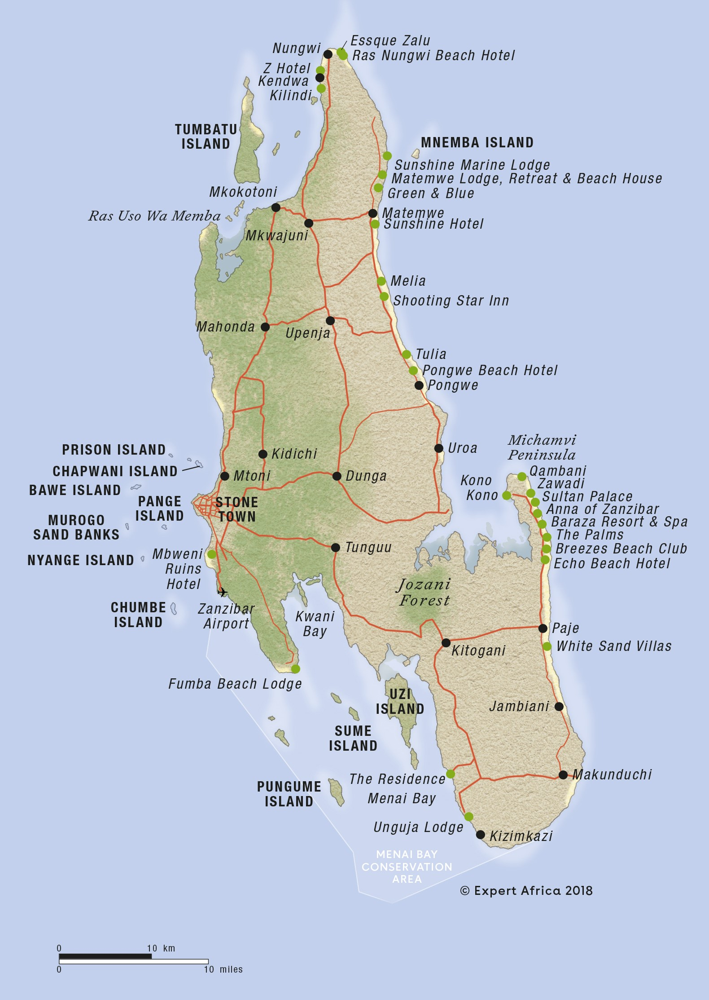

# Development of IoT-driven solutions for smart connected islands

## Description
For a partner in Zanzinbar, Tanzania we are developing a solution to
monitor environmental factors of the local island cluster. First we do a roll-out of a 
stable IoT Network. The proof of concept (POC) for this network is a maximum
coverage with a minimum of hardware.

The development of the solution takes place at the AP University of Applied Sciences. The students
will travel to Zanzibar for the roll out.

## Location

The solution will be used by [Karume Institute of Science]
and Technology - Zanzibar](https://kist.ac.tz/) (KIST). KIST is located in Zanzibar

 

###  planning 
TBD

## Work in Progress

### IoT Network Kit
An IoT Network Kit (INK) will be developed which will be completely independent
of the local infrastructure. 

Questions:
•	Location for the LoRaWAN Gateway. 
Requirements:
o	As high as possible
o	Ethernet 10/100Mbit available? 220 or 110voltage power supply? 

### Sensor-module

- Salinity in the sea water surrounding those islands causes a temperature rise and effecting fishes
- Mangrove status availability ?
- Climate change: monitoring temperature, air quality
- monitoring sea water level, size of island , forest density => satelite based => next year project

### Database
Data from the sensors will be used for a real-time visualization of the islands. Data will be accessible via an API.

### Digital twin

The real-life data will be used in an immersive/mobile user interface.

### Documentation

## Deliverables

* IoT Network kit
* Planning of installation
* 10 Sensormodules
* Node-Red application server
* Digital twin for android & oculus quest
* Course material
* Documentation in English

## Voorgaande projecten 
* [Air Quality Sensor](https://ap-it-gh.github.io/ssys21-docs-luchtsensor/#/)
* [ACTEA - Embedded Measurement & Control Course](assets/actea-m2c8-emc.zip)
